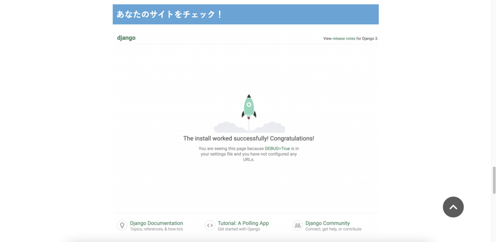
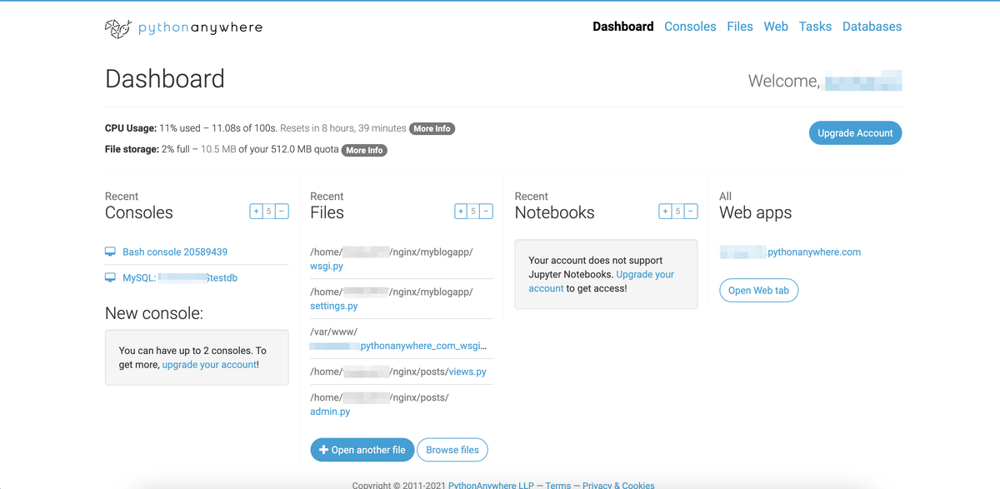
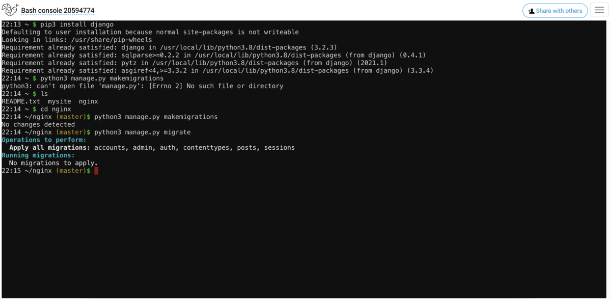
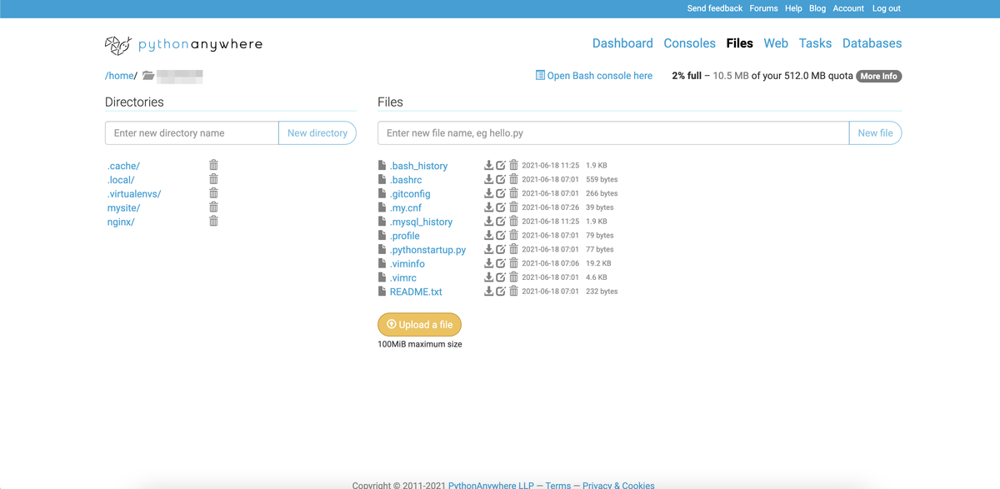
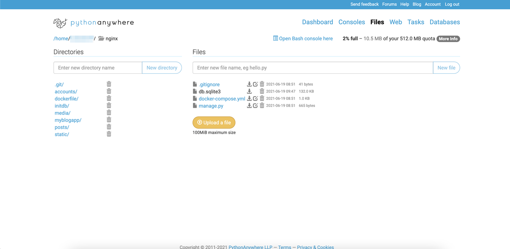

# How to use Pythonanywhere

Pythonで書いたWebプログラムを簡単にインターネット環境で使えるようになる「Pythonanywhere」の使い方、主に自分が書いたコードをデプロイして公開するまでのやり方について自分のためのメモ書きとして残すのが目的であります

## わからないならインターネッツを調べてみよう

Pythonの勉強でWEBで動くヤツを作ってみたんだが、ローカルで動かすのもつまらないので、なにかインターネット上で動かせないかと探してみたらまず見つかったのが「Heroku」でした。

<a href="https://jp.heroku.com/home">クラウド・アプリケーション・プラットフォーム | Heroku</a>

こちらは環境にちょっとクセがあったりするけどデプロイは簡単で、自分が勝手に作ったプログラムがインターネット上で動くのを確認してちょっとカンドーした。でもDjangoを使ったときの静的ファイルの扱いなどがよくわからんから現在はstreamlitというライブラリを利用した新型コロナ関連情報のポータルサイトを動かすして、日本政府の不甲斐なさを嘆いております。緊急事態宣言発令とか終了に合わせて時々メンテしたりしております。

<a href="https://thawing-lowlands-93532.herokuapp.com/">st_covid19 · Streamlit (thawing-lowlands-93532.herokuapp.com)</a>

 んで、ほかにも無料で利用できるサービスが無いかと探してみると見つかったのが「Pythonanywhere」というサービスだったので、こっちも使おうとしてみたんだけど使い方がよくわからない。なので早速ググってみたわけです。

<a href="https://www.pythonanywhere.com/">Host, run, and code Python in the cloud: PythonAnywhere</a>

## 今回いちばん言いたかったこと「オマエラ、実際に動かしてみたんか？」

で、日本語の紹介がたくさんヒットしたからそいつらを参考にしていじってみたんだがうまくいかん。なんでうまくいかんのじゃと人のせいにしながら軽く怒りつつ続けて色々と試してみた。すると見つかったそれらのサイトの記述には書いてることは同じで体裁だけが違うだけのものがたくさんあるのに気がついた。ってか、同じじゃん。その上「githubにある自分のソースをデプロイするやり方」の説明で「これでデプロイ完了です」と書いているのに、そこに掲載されているデプロイが完了した「あなたの画面」は、Djangoでプロジェクト作成後に立ち上げみるテストサーバーの画面だったりするわけで、それは自分のサービスじゃないだろ？それはDjangoが出してるテスト用初期画面だろ？そんな程度で「これであなたのサービスが公開できる」とドヤ顔のサイトがたくさんあったのでガッカリする。

オマエラ、実際に動かしてないだろ？他のサイトを見て、コピペしてエラそうにしてるだけだろ？！そんなの勉強しようとしているヒトタチのノイズになるだけだからやめろ。

これはDjangoの環境が正しく作られたかどうか確認するときの画面で、コードを一行も書かなくても出てくるヤツ。PythonanywhereでDjangoのサービスを作成しただけで出てくるヤツ。こいつは日本語設定もされてない手抜きなヤツ。

もちろん詳しく丁寧に書かれたサイトもあるんだが、詳しすぎて素人のワシにはよくわからんかったから、これからPythonanywhereを触ってみたいと思っている初心者のヒトタチのためにワシがやって実際に動くまでにやったことを書いてみる。これが正しいやり方かどうかはわからんが、取りあえず動いたのでやって見る価値がゼロではないよ。

## Pythonanywhereの登録とかは他の詳しいサイトを参照すべし

Pythonanywhereサービスの細かい内容や登録方法などはググってみてください。

いろんなサイトに最初にTokenを取得しろと書いてありますが、これはサイトへの接続テストをするくらいで、実際のデプロイで使うことはありませんでした。でも取得せよと軒並み書いてあるのでとりあえずとっとく。

Djangoの環境設定（特にDEBUGモードの設定による振る舞いの違い）についても最低限の知識は事前にゲットしたうえでローカルで動くDjangoのソース群の準備は大前提です。

それからgithubから資源をアップロードするので、まずはそちらのアカウントを取得したのち資源をプッシュしておいてください。githubがよくわからん人はそっちも先に調べててくだされ。

ちらりとLinuxコマンドも使いますので、一番基本的なコマンドが書いてあるサイトを見つけておいてください。

サイトによっては「仮想環境を作って」などと書いてるけど、仮想環境を作らなくても動きます。設定項目が増えるので、めんどくさい人は仮想環境を作らなくても大丈夫（めんどくさいし、トラブった時の問題解決をシンプルにしたかったからワシは作らずにやりました）

Pythonanywhereのダッシュボード画面です。ここからいろんな機能に飛んだりできますね。

以下、「」で囲んでいるのはPythonanywhereが提供する機能名です。

で、まずやることは「Web」からメニューに沿ってdjangoで動く環境を作ること。そうすると上のロケットが出てくる画面が表示できるところまでできる。

次に「Console」でgithubのリポジトリをクローンする。これについてはpythonanywhereというライブラリをインストールして、コマンドを叩けばいいと書いてあるサイトも多いんだが、ワシの場合はそれだとなんだかうまくいかなかったということもあって、素直にgithubからクローンしてやったぜ。

”git clone https://github.com/自分のユーザ名/リポジトリ名”　と入力して実行するだけ

(https://以降は開いている自分のリポジトリのURLをコピペすればオーケー）

Consoleは普通のBashなので、怖がらずにコマンドを打っちゃってください。ディレクトリ間違えて実行しているのは見て見ぬ振り。

そうすると自分のPythonanywhereの環境にリポジトリ名が付いたフォルダが作成され、その下に資源がアップロードされます。

今回はdockerで動かしてみた時のリポジトリをそのまま使いました。nginxという名前は、Webサーバにnginxを使ってたからわかりやすいと思って付けただけです。mysite/というのは、WSGIファイルの設定を楽にするためにPythonanywhereで作ったダミーのDjangoプロジェクトです。こいつは自分のソースで動き始めたら消してもオーケー

nginx/配下はこんなかんじ。ここにもテスト用やdocker用に作ったときの名残がたくさん残ってます。

以下誠意作成中

